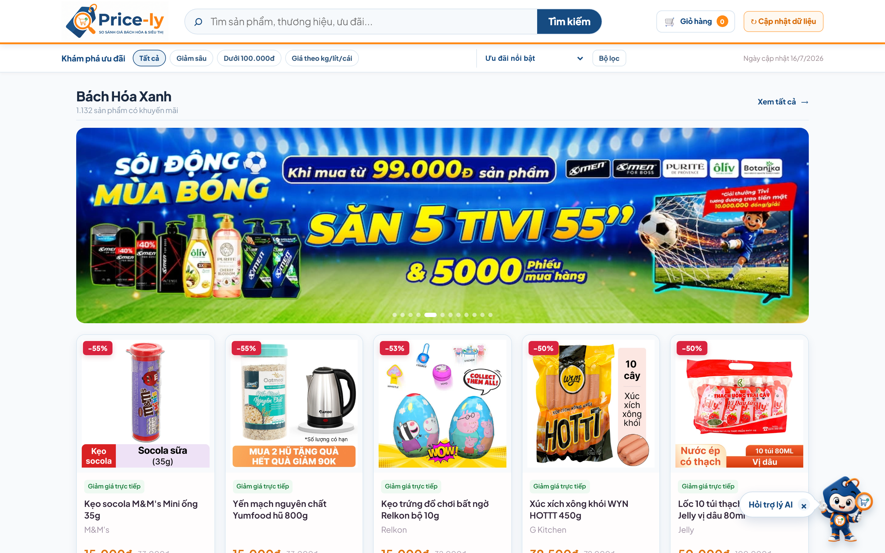
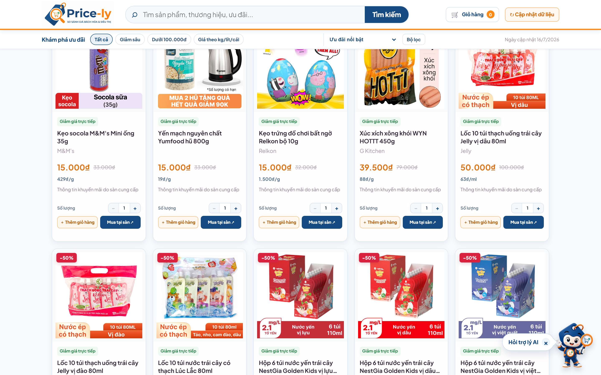
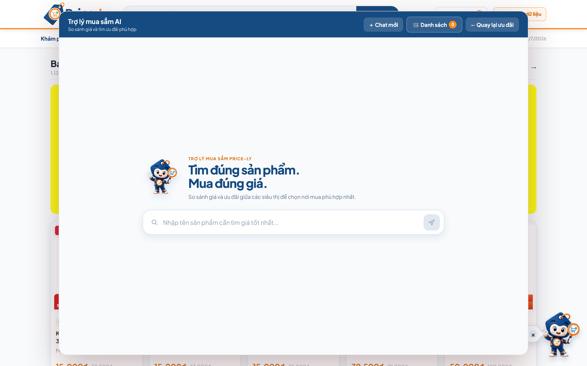
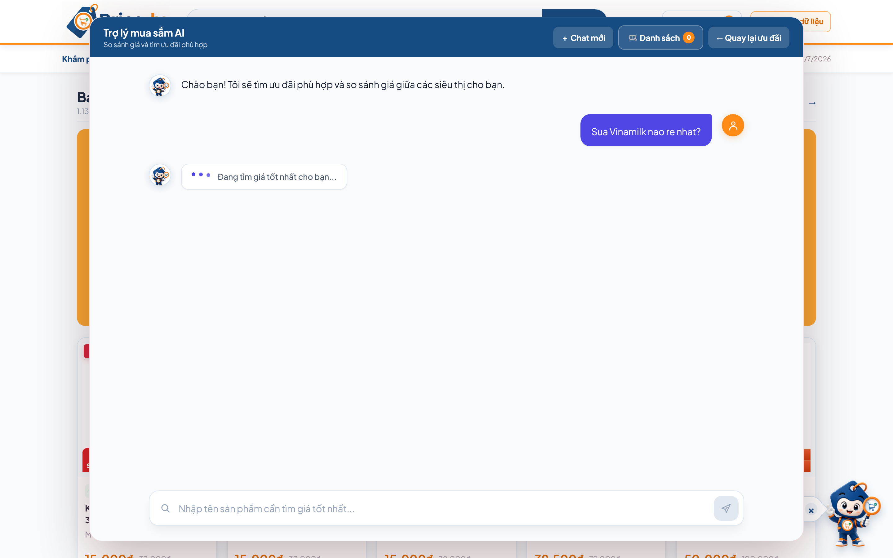
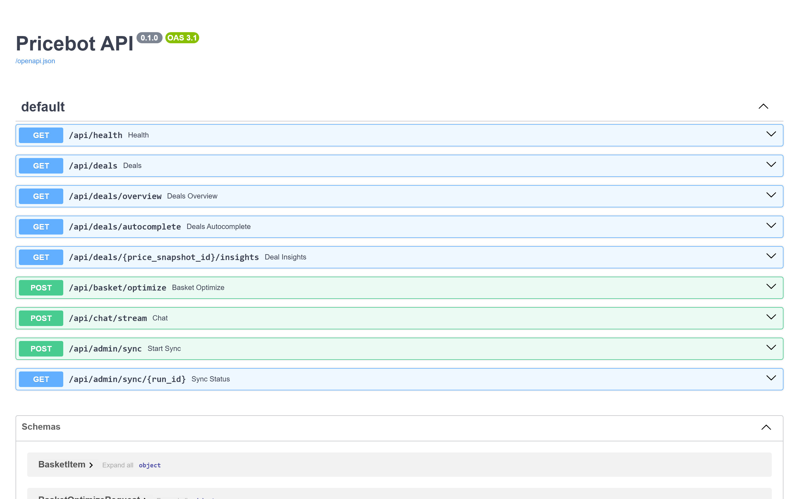

<div align="center">



<br/>

# 🏷️ PriceLy — Vietnamese Supermarket Price Comparison

**AI-powered chatbot & deals explorer that compares prices across Vietnam's top supermarkets in real time.**

[](https://nextjs.org/)
[](https://react.dev/)
[](https://www.typescriptlang.org/)
[](https://fastapi.tiangolo.com/)
[](https://python.org/)
[](https://www.postgresql.org/)

[](https://docs.docker.com/compose/)
[](https://min.io/)
[](https://spark.apache.org/)
[](https://hudi.apache.org/)
[](https://ollama.com/)
[](https://playwright.dev/)

<br/>

[🚀 Getting Started](#-getting-started) •
[📸 Screenshots](#-screenshots) •
[🏗️ Architecture](#️-system-architecture) •
[📡 API Reference](#-api-reference) •
[🔧 Configuration](#-configuration)

</div>

---

## 📋 Table of Contents

- [Overview](#-overview)
- [Key Features](#-key-features)
- [Screenshots](#-screenshots)
- [System Architecture](#️-system-architecture)
- [Data Pipeline](#-data-pipeline)
- [Tech Stack](#️-tech-stack)
- [Project Structure](#-project-structure)
- [Getting Started](#-getting-started)
  - [Prerequisites](#prerequisites)
  - [Quick Start with Docker](#1️⃣-quick-start-with-docker)
  - [Local Development](#2️⃣-local-development)
- [Configuration](#-configuration)
- [API Reference](#-api-reference)
- [Data Engineering](#-data-engineering)
- [Testing](#-testing)
- [Contributing](#-contributing)
- [License](#-license)

---

## 🌟 Overview

**PriceLy** is a full-stack grocery search and comparison platform. It integrates a **data lakehouse** (Bronze → Silver → Gold pipeline) managed with Apache Spark and Hudi, a real-time serving layer in PostgreSQL, and an AI-assisted search capability.

Through a modern Next.js interface, users can search the deals catalog and chat with an AI mascot overlay. The assistant analyzes user query intents (extracting brands, retailers, and packaging constraints) and matches results using PostgreSQL full-text search combined with Ollama-powered semantic embedding rerankers. It offers structured price comparisons, historical price trends, and optimization of multi-retailer shopping baskets.

### 🛒 Supported Retailers

<table>
<tr>
<td align="center" width="20%">

**🟢 Bách Hóa Xanh**

</td>
<td align="center" width="20%">

**🟠 GO!**

</td>
<td align="center" width="20%">

**🔴 Lotte Mart**

</td>
<td align="center" width="20%">

**🔵 MM Mega Market**

</td>
<td align="center" width="20%">

**🟡 WinMart**

</td>
</tr>
</table>

---

## ✨ Key Features

<table>
<tr>
<td width="50%">

### 🤖 AI Chatbot Assistant
- **Natural language support**: Chat and search in natural Vietnamese
- **Rule-validated Ollama intent parsing**: Accurately extracts brands, retailers, price bounds, and strict packaging constraints
- **Semantic + Lexical hybrid search**: Combines `bge-m3` embeddings cosine similarity with SQL full-text search (Reciprocal-Rank Fusion)
- **Factual template-driven answers**: Safely builds text responses using verified PostgreSQL data (protects against hallucinations and SQL injection)
- **Memory-based session context**: Supports follow-up questions (e.g. "Còn Lotte thì sao?") using prior message payload context
- **📈 Price Trend Alerts**: Dynamically tracks the 7-day historical price movement of recommended items and displays day-to-day fluctuations
- **🛒 Direct Basket Actions**: Auto-adds recommended items to the cart or automatically triggers cart optimization/viewing upon request
- **⚠️ Data Quality Warnings**: Flags matching products that have data quality warnings to ensure purchase confidence
- **💡 Clickable suggestions**: Welcome screen features interactive quick prompts to guide query options (e.g., "So sánh giá sữa Vinamilk 1L")

</td>
<td width="50%">

### 🏷️ Deals Explorer
- Browse promotional flyers and banners across all 5 retailers
- Advanced filters: Brand, retailer, price range, discount percent, unit price availability, and data quality status
- Autocomplete search suggestions (debounced at 220ms)
- Dual layout: Grid view for visual cards and Table view for detailed pricing comparison

</td>
</tr>
<tr>
<td width="50%">

### 🛒 Basket Optimizer
- Add deals directly to a local shopping basket
- Single-Retailer Optimization: Finds the cheapest single store containing all items (minimizes trips)
- Split-Order Optimization: Splits items among different retailers to achieve the absolute lowest total cost
- Multi-tab synchronized basket state using `localStorage` events

</td>
<td width="50%">

### 📊 Data Pipeline & Sync
- Medallion architecture (Bronze → Silver → Gold Hudi tables on MinIO)
- Automated Playwright web scrapers
- Daily historical price tracker stored in PostgreSQL for trend charts and price volatility analysis
- Safe on-demand administrator sync with PG advisory locks and real-time progress updates

</td>
</tr>
</table>

### Additional Highlights

| Feature | Description |
|---------|-------------|
| 📱 **Responsive Design** | Custom CSS layout optimized for desktop, tablet, and mobile (no framework bloat) |
| 📏 **Strict Package Matching** | Ensures queries specifying a size (e.g. `1L`) strictly match product sizes, filtering out mismatched packages |
| 📊 **Price Volatility Trends** | Displays day-to-day price movement over the last 7 to 90 days for specific products |
| 🎯 **Match Confidence** | Displays semantic similarity confidence scores for cross-supermarket item mapping |
| 🛡️ **Hallucination Protection** | Fully template-driven response generation using verified PostgreSQL records (Ollama cannot invent prices) |

---

## 📸 Screenshots

### 🏠 Homepage — Deals Explorer

> Browse promotions with banner carousel, discount badges, filter tabs, and real product images from retailers.


<br/>

### 🏷️ Product Cards with Prices

> Each product card shows current price, original price (strikethrough), discount percentage, unit price, retailer info, and add-to-basket controls.



### 💬 AI Chatbot Overlay

> The AI chatbot is accessible directly from any page via the bottom-right FAB mascot. It opens as an interactive overlay panel allowing real-time grocery queries without leaving the deals catalog.



<br/>

### 💬 Chatbot in Action

> Ask questions in natural Vietnamese, such as "Sữa Vinamilk nào rẻ nhất?", to trigger intent parsing, retailer database queries, and automatic price comparisons.



<br/>

### 📡 API Documentation — Swagger UI

> Interactive Swagger UI auto-generated from FastAPI with all 10 endpoints documented.



---

## 🏗️ System Architecture

For a comprehensive file-by-file breakdown of the backend, database schemas, and step-by-step lifecycles of queries, see the detailed [SYSTEM_ARCHITECTURE.md](file:///c:/2nd%20Disk/intern/price-comparision/SYSTEM_ARCHITECTURE.md) guide.

```
┌─────────────────────────────────────────────────────────────────────┐
│                        DATA INGESTION LAYER                        │
│  ┌──────────┐ ┌──────────┐ ┌──────────┐ ┌──────────┐ ┌──────────┐ │
│  │ Bách Hóa │ │   GO!    │ │  Lotte   │ │  MM Mega │ │ WinMart  │ │
│  │  Xanh    │ │          │ │  Mart    │ │  Market  │ │          │ │
│  └────┬─────┘ └────┬─────┘ └────┬─────┘ └────┬─────┘ └────┬─────┘ │
│       └──────────┬──┴───────────┬┴────────────┴──────────┬─┘       │
│                  │   Playwright │ Crawlers               │         │
│                  └──────────────┼─────────────────────────┘         │
│                                ▼                                   │
│                    ┌────────────────────┐                           │
│                    │  Bronze → Silver   │ PySpark + Hudi            │
│                    │  → Gold Pipeline   │                           │
│                    └─────────┬──────────┘                           │
│                              ▼                                     │
│                    ┌────────────────────┐                           │
│                    │  MinIO (S3-compat) │ Gold Hudi Tables          │
│                    └─────────┬──────────┘                           │
└──────────────────────────────┼──────────────────────────────────────┘
                               │ sync.py
                               ▼
┌──────────────────────────────────────────────────────────────────────┐
│                        APPLICATION LAYER                            │
│  ┌─────────────────────────────────────────────────────────────┐    │
│  │                    FastAPI Backend                           │    │
│  │  ┌──────────┐ ┌──────────────┐ ┌────────────┐ ┌──────────┐ │    │
│  │  │ intent.py│ │search_index  │ │matching.py │ │ sync.py  │ │    │
│  │  │ (Ollama) │ │ (BGE-M3)     │ │            │ │          │ │    │
│  │  └──────────┘ └──────────────┘ └────────────┘ └──────────┘ │    │
│  └──────────────────────┬──────────────────────────────────────┘    │
│                         │                                          │
│  ┌──────────────────────▼──────────────────────────────────────┐    │
│  │                    PostgreSQL 16                             │    │
│  │ offers_current │ offer_price_history │ dimensions │ sync   │    │
│  └─────────────────────────────────────────────────────────────┘    │
└──────────────────────────────────────────────────────────────────────┘
                               │ REST API
                               ▼
┌──────────────────────────────────────────────────────────────────────┐
│                       PRESENTATION LAYER                            │
│  ┌─────────────────────────────────────────────────────────────┐    │
│  │                Next.js 15 + React 19 + TypeScript           │    │
│  │  ┌──────────┐  ┌───────────────┐  ┌─────────────────────┐  │    │
│  │  │ Chatbot  │  │ Deals Explorer│  │ Basket Optimizer    │  │    │
│  │  │ (SSE)    │  │ (Filters)     │  │ (Multi-retailer)    │  │    │
│  │  └──────────┘  └───────────────┘  └─────────────────────┘  │    │
│  └─────────────────────────────────────────────────────────────┘    │
└──────────────────────────────────────────────────────────────────────┘
```

---

## 🔄 Data Pipeline

| Stage | Technology | Description |
|-------|-----------|-------------|
| **🥉 Bronze** | Playwright + JSONL | Raw crawled data from retailer websites, partitioned by date |
| **🥈 Silver** | PySpark + Hudi | Cleaned, deduplicated, and standardized product records |
| **🥇 Gold** | Hudi on MinIO | Curated, business-ready tables with quality validation |
| **🟢 Serving** | PostgreSQL 16 | Indexed serving tables with full-text search and embeddings |

The pipeline follows a **medallion architecture** where data flows from raw → cleaned → curated → serving:

1. **Crawlers** run on schedule and produce daily JSONL snapshots per retailer
2. **PySpark** reads raw data, applies schema validation, deduplication, and normalization
3. **Hudi** manages incremental upserts into the Gold layer on MinIO
4. **sync.py** reads Gold tables, refreshes current serving data, and upserts daily price history into PostgreSQL
5. **search_index.py** builds lexical indexes and semantic embeddings (BGE-M3) for hybrid search

---

## 🛠️ Tech Stack

### Frontend

| Technology | Version | Purpose |
|-----------|---------|---------|
|  | 15.5 | React framework with App Router and SSR |
|  | 19.1 | UI component library with Hooks |
|  | 5.8 | Type-safe JavaScript with strict mode |
|  | 3 | Custom design system (no framework dependency) |

### Backend

| Technology | Version | Purpose |
|-----------|---------|---------|
|  | 0.115 | High-performance async Python API |
|  | 2.0 | ORM and database schema management |
|  | 2.9 | Settings management and data validation |
|  | — | Local LLM for intent analysis (Qwen 2.5 3B) |
|  | 0.28 | Async HTTP client for external services |

### Data & Infrastructure

| Technology | Version | Purpose |
|-----------|---------|---------|
|  | 16 | Primary serving database with full-text search |
|  | — | S3-compatible object storage for Gold layer |
|  | 3.5 | Distributed data processing engine |
|  | 1.2 | Lakehouse table format with ACID transactions |
|  | Compose v2 | Container orchestration and deployment |
|  | 1.52 | Browser automation for web crawling |
|  | 2.2 | Embedding vector operations |
|  | 1.37 | S3/MinIO client SDK |

---

## 📁 Project Structure

```
price-comparision/
│
├── 🎨 frontend/                        # Next.js 15 web application
│   ├── app/
│   │   ├── page.tsx                     # Redirects / to /deals
│   │   ├── deals-client.tsx             # Deals explorer, popup chatbot, basket & sync
│   │   ├── chat-panel.tsx               # Chatbot popup UI and SSE client
│   │   ├── basket.ts                    # Basket state management & types
│   │   ├── deals/page.tsx               # Standalone deals route
│   │   ├── layout.tsx                   # Root layout with metadata
│   │   ├── globals.css                  # Complete design system (78KB+)
│   ├── public/
│   │   ├── banners/                     # Retailer promotional banners
│   │   │   ├── bachhoaxanh/             # 12 rotating banners
│   │   │   ├── go/
│   │   │   ├── lottemart/
│   │   │   ├── mmvietnam/
│   │   │   └── winmart/
│   │   └── brand/
│   │       ├── pricely-logo.png         # Application logo
│   │       └── pricely-mascot.png       # AI assistant mascot
│   ├── Dockerfile                       # Multi-stage production build
│   ├── package.json
│   └── tsconfig.json
│
├── ⚙️ backend/                          # FastAPI Python backend
│   ├── app/
│   │   ├── main.py                      # FastAPI app, routes & SSE chat
│   │   ├── config.py                    # Pydantic settings from env
│   │   ├── database.py                  # SQLAlchemy models & schema
│   │   ├── intent.py                    # LLM intent analysis & context
│   │   ├── matching.py                  # Product normalization & matching
│   │   ├── repository.py               # Data queries & basket optimizer
│   │   ├── search_index.py             # Lexical + semantic search engine
│   │   └── sync.py                      # Gold Hudi → PostgreSQL sync
│   ├── tests/                           # Comprehensive test suite
│   │   ├── test_api.py                  # API endpoint tests
│   │   ├── test_intent.py               # Intent parsing tests
│   │   ├── test_matching.py             # Product matching tests
│   │   ├── test_search_index.py         # Search engine tests
│   │   ├── test_sync.py                 # Data sync tests
│   │   ├── test_basket_optimizer.py     # Basket optimization tests
│   │   ├── test_conversation_repository.py
│   │   └── test_discovery_api.py        # Deals discovery tests
│   ├── Dockerfile
│   └── requirements.txt
│
├── 📊 data_engineering/                 # Data pipeline components
│   ├── docs/
│   │   ├── lakehouse_hudi_pipeline_design.md
│   │   ├── lakehouse_table_catalog.md
│   │   ├── minio_data_guide_for_ai_engineer.md
│   │   └── minio_machine_2_runbook.md
│   └── notebooks/
│       └── read_hudi_minio.ipynb        # Hudi/MinIO data inspection
│
├── 🖼️ banners/                          # Source banner images by retailer
│   ├── bachhoaxanh/
│   ├── go/
│   ├── lottemart/
│   ├── megamarket/
│   └── winmart/
│
├── 📖 docs/
│   └── images/                          # README screenshots (real captures)
│
├── 🐳 docker-compose.yml               # PostgreSQL + Backend + Frontend
├── 📋 .env.example                      # Environment variable template
├── 📦 requirements.txt                  # Playwright dependency for README screenshots
├── 🚫 .gitignore
└── 📄 README.md                         # ← You are here
```

---

## 🚀 Getting Started

### Prerequisites

| Requirement | Version | Notes |
|-------------|---------|-------|
| **Docker Desktop** | v4+ | Docker Compose v2 included |
| **Ollama** | Latest | Running on host machine |
| **MinIO credentials** | — | Read-only access to Gold bucket |
| **Python** | 3.10+ | Only if running crawlers outside Docker |

### 1️⃣ Quick Start with Docker

#### Step 1: Clone & Configure

```bash
git clone https://github.com/your-org/price-comparision.git
cd price-comparision

# Create environment file from template
cp .env.example .env
# Edit .env with your MinIO credentials
```

#### Step 2: Start Ollama

```powershell
# In a separate terminal
ollama serve

# Pull required models
ollama pull qwen2.5:3b       # Intent analysis
ollama pull bge-m3:latest     # Semantic embeddings
```

#### Step 3: Launch Services

```powershell
docker compose up --build -d
docker compose ps
```

#### Step 4: Access the Application

| Service | URL | Description |
|---------|-----|-------------|
| 🌐 **Frontend** | http://localhost:3000 | Main web application |
| 📡 **API Health** | http://localhost:8000/api/health | Service health check |
| 📖 **Swagger UI** | http://localhost:8000/docs | Interactive API documentation |
| 🗄️ **PostgreSQL** | `localhost:5432` | Database (user: `pricebot`) |

#### Step 5: Sync Data

Trigger a data sync from MinIO to populate the database:

```powershell
# Via API
curl.exe -X POST http://localhost:8000/api/admin/sync

# Or use the "Cập nhật dữ liệu" button in the sidebar
```

> [!TIP]
> The health endpoint (`/api/health`) reports status for **database**, **ollama**, and **latest_sync**. Check it after startup to confirm all services are connected.

### 2️⃣ Local Development

<details>
<summary><b>🔧 Backend (FastAPI)</b></summary>

```powershell
# Create virtual environment
python -m venv .venv
.\.venv\Scripts\Activate.ps1

# Install dependencies
pip install -r backend/requirements.txt

# Start the backend (ensure PostgreSQL is running via Docker)
uvicorn backend.app.main:app --reload --host 0.0.0.0 --port 8000
```

</details>

<details>
<summary><b>🎨 Frontend (Next.js)</b></summary>

```powershell
cd frontend
npm install
npm run dev
```

The frontend defaults to `http://localhost:8000` as the API URL. Override with:
```powershell
$env:NEXT_PUBLIC_API_URL = "http://localhost:8000"
npm run dev
```

</details>

### ⏹️ Stopping & Restarting

```powershell
# Stop without losing data
docker compose stop

# Restart
docker compose start

# ⚠️ Full teardown (DELETES database volume!)
docker compose down -v
```

> [!WARNING]
> Do **not** use `docker compose down -v` unless you want to wipe the PostgreSQL data. Use `docker compose stop` / `start` to preserve synced data.

---

## 🔧 Configuration

All configuration is managed through environment variables. Copy `.env.example` to `.env` and update:

<details>
<summary><b>📋 Full Environment Variables Reference</b></summary>

| Variable | Required | Default | Description |
|----------|:--------:|---------|-------------|
| `MINIO_ENDPOINT` | ✅ | `http://192.168.199.73:9020` | MinIO server address |
| `MINIO_ACCESS_KEY` | ✅ | — | Read-only MinIO access key |
| `MINIO_SECRET_KEY` | ✅ | — | Read-only MinIO secret key |
| `MINIO_BUCKET` | — | `supermarket-lakehouse` | S3 bucket name |
| `MINIO_PREFIX` | — | `gold` | Key prefix for Gold tables |
| `OLLAMA_BASE_URL` | — | `http://host.docker.internal:11434` | Ollama API endpoint |
| `OLLAMA_MODEL` | — | `qwen2.5:3b` | LLM model for intent analysis |
| `EMBEDDING_MODEL` | — | `bge-m3:latest` | Model for semantic embeddings |
| `POSTGRES_PASSWORD` | — | `pricebot` | PostgreSQL password |
| `CORS_ORIGINS` | — | `http://localhost:3000` | Allowed CORS origins (comma-sep) |
| `HUDI_PACKAGES` | — | `org.apache.hudi:hudi-spark3.5-bundle_2.12:1.2.0,...` | Spark/Hudi packages |

</details>

> [!CAUTION]
> Never commit `.env` or credentials to version control. Only `.env.example` with placeholder values should be tracked.

---

## 📡 API Reference


### Core Endpoints

| Method | Endpoint | Description |
|:------:|----------|-------------|
| `GET` | `/api/health` | Health check — database, Ollama & last sync status |
| `POST` | `/api/chat/stream` | 💬 Send a question, receive streaming SSE response |
| `GET` | `/api/deals` | 🏷️ Paginated deals list with filters |
| `GET` | `/api/deals/overview` | 📊 Grouped deals overview by retailer |
| `GET` | `/api/deals/autocomplete?q=...` | 🔍 Product/brand autocomplete suggestions |
| `GET` | `/api/deals/{id}/insights` | 📈 Compare a deal with similar products |
| `GET` | `/api/deals/{id}/history?days=90` | 📉 Daily retained price history for time-series features |
| `POST` | `/api/basket/optimize` | 🛒 Optimize shopping basket across retailers |
| `POST` | `/api/admin/sync` | 🔄 Trigger Gold data sync from MinIO |
| `GET` | `/api/admin/sync/{run_id}` | 📋 Track sync progress and status |

### Example Requests

<details>
<summary><b>💬 Chat Streaming</b></summary>

```bash
curl -X POST http://localhost:8000/api/chat/stream \
  -H "Content-Type: application/json" \
  -d '{"message": "Sữa Vinamilk nào rẻ nhất?"}'
```

Response: Server-Sent Events stream with `event: conversation`, `event: results`, `event: answer`.

</details>

<details>
<summary><b>🏷️ Filter Deals</b></summary>

```
GET /api/deals?retailer_ids=go&min_discount_percent=10&sort=discount
```

Query parameters: `retailer_ids`, `brand`, `min_price`, `max_price`, `min_discount_percent`, `sort`, `page`, `per_page`.

</details>

<details>
<summary><b>🛒 Optimize Basket</b></summary>

```bash
curl -X POST http://localhost:8000/api/basket/optimize \
  -H "Content-Type: application/json" \
  -d '{"items": [{"price_snapshot_id": "abc123", "quantity": 2}]}'
```

</details>

---

## 📊 Data Engineering

The application consumes Gold Hudi data already available on MinIO. This repository contains the integration, inspection notebook and operational documentation; it does not include crawler source code.

### 📚 Documentation

| Document | Description |
|----------|-------------|
| [Pipeline Design](data_engineering/docs/lakehouse_hudi_pipeline_design.md) | Lakehouse pipeline architecture & design decisions |
| [Table Catalog](data_engineering/docs/lakehouse_table_catalog.md) | Gold table schemas, partitioning & key definitions |
| [MinIO Data Guide](data_engineering/docs/minio_data_guide_for_ai_engineer.md) | How to read and work with Gold data on MinIO |
| [MinIO Runbook](data_engineering/docs/minio_machine_2_runbook.md) | Operational procedures for MinIO administration |

---

## 🧪 Testing

### Backend Tests

To run the backend tests, you must specify `backend` in your `PYTHONPATH` so the `app` module imports correctly.

**PowerShell (Windows):**
```powershell
# Run all tests
$env:PYTHONPATH="backend"; pytest backend/tests

# Run specific test suite
$env:PYTHONPATH="backend"; pytest backend/tests/test_intent.py -v
$env:PYTHONPATH="backend"; pytest backend/tests/test_matching.py -v
```

**Bash (Linux/macOS):**
```bash
# Run all tests
PYTHONPATH=backend pytest backend/tests

# Run specific test suite
PYTHONPATH=backend pytest backend/tests/test_intent.py -v
```

**Test coverage includes:**

| Test Suite | Coverage |
|-----------|----------|
| `test_api.py` | API endpoint integration tests |
| `test_intent.py` | Vietnamese NLP intent parsing & entity extraction |
| `test_matching.py` | Product normalization & cross-retailer matching |
| `test_search_index.py` | Lexical & semantic search ranking |
| `test_sync.py` | MinIO → PostgreSQL data synchronization |
| `test_basket_optimizer.py` | Multi-retailer basket optimization logic |
| `test_conversation_repository.py` | Chat history & conversation management |
| `test_discovery_api.py` | Deals discovery & filtering queries |

### Frontend Build

```powershell
cd frontend
npm run build    # Production build
npm run lint     # TypeScript & ESLint checks
```

---

## 💬 Example Queries

Try these Vietnamese queries in the chatbot:

| Query | What it does |
|-------|-------------|
| `Sữa Vinamilk nào rẻ nhất?` | Find cheapest Vinamilk milk across all retailers |
| `So sánh dầu ăn Neptune 2L giữa WinMart và GO` | Compare Neptune cooking oil between two retailers |
| `Có ưu đãi nước giặt nào không?` | Search for laundry detergent promotions |
| `Tôi muốn mua kem đánh răng cho mẹ` | Natural language toothpaste recommendation |
| `Tìm sản phẩm giảm giá trên 30%` | Products with >30% discount |
| `Bột giặt OMO giá bao nhiêu ở Lotte Mart?` | Check specific product price at a retailer |

---

## 🤝 Contributing

Contributions are welcome! Please follow these guidelines:

1. **Fork** the repository and create a feature branch
2. **Don't commit** `.env`, credentials, virtual environments, or auto-generated caches
3. Run `git status` before committing — only include source code, docs, and necessary assets
4. Banners in `banners/` and `frontend/public/banners/` are UI assets — only change when updating display content
5. Write tests for new backend features

---

## 📄 License

This project is developed as an internal tool. Contact the maintainers for licensing information.

---

<div align="center">

**Built with ❤️ for Vietnamese consumers**

<sub>Helping you find the best grocery deals across Vietnam's top supermarkets</sub>

<br/>


</div>
