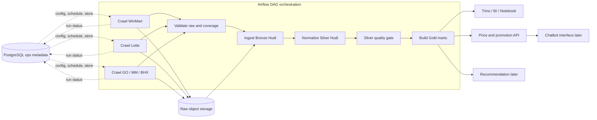

# Thiet ke Data Lakehouse voi Apache Hudi cho he thong so sanh gia khuyen mai

## 1. Muc tieu nghiep vu

He thong can ho tro cac bai toan chinh:

- Theo doi gia niem yet, gia khuyen mai, co che khuyen mai va ton kho theo tung sieu thi/cua hang/khu vuc.
- So sanh gia cung mot san pham giua nhieu retailer: WinMart, Co.opmart, GO!/Big C, Lotte Mart, Bach Hoa Xanh, AEON.
- Phat hien thay doi gia, khuyen mai moi, khuyen mai het han.
- Tao dataset sach cho BI, data science, recommendation va chatbot sau nay.
- Giu du raw payload de audit khi scraper parse sai hoac website thay doi layout/API.

Quan diem thiet ke: **lakehouse la source of truth cho analytical data**, con RDBMS/NoSQL chi dung cho metadata, app serving hoac state van hanh.

## 2. Kien truc tong quan da hieu chinh

Airflow dieu phoi toan bo luong, bao gom ca crawl. Airflow khong chua logic parse du lieu;
no goi scraper, theo doi retry/timeout/SLA va chi cho du lieu dat quality gate di tiep.
PostgreSQL chi la operational metadata/control plane, khong phai nguon gia san pham.



### 2.1. Failure isolation trong mot phien import

- Moi retailer/store la mot task hoac task group rieng, co retry va timeout rieng.
- Mot crawler fail khong huy output raw cua crawler da thanh cong.
- Task `validate raw and coverage` ghi run la `success`, `partial` hoac `failed`.
- Chi partition/source dat schema va DQ moi vao Silver; record loi vao quarantine.
- Gold chi publish snapshot khi dat nguong coverage da cau hinh. Neu partial van publish thi phai
  mang `run_status`, `source_coverage` va `freshness` de app khong hieu nham la day du.
- Loi ha tang chung nhu object storage/catalog khong truy cap duoc thi dung downstream, vi tiep tuc
  se tao ket qua khong the audit.

Airflow nen dung trigger rule co chu dich: crawl tasks doc lap co the tiep tuc; validation chay sau
`all_done`; publish Gold chi chay khi quality gate thanh cong.

Recommended MVP flow:

```text
Python scraper -> raw JSONL/HTML -> Spark batch -> Hudi bronze -> Hudi silver -> Hudi gold -> Trino/Superset/Notebook
```

Scale-up flow:

```text
Python scraper / Kafka events -> Spark Structured Streaming or batch -> Hudi MOR/COW -> Trino/Spark SQL -> BI/ML/Apps
```

Danh gia: pipeline nay hop ly cho bai toan, nhung MVP chi can batch. Kafka, feature store,
vector database va streaming la kha nang mo rong, khong phai dependency cua luong crawl hien tai.

## 3. Vi sao dung Apache Hudi

Apache Hudi phu hop vi bai toan gia/khuyen mai co nhieu ban ghi cap nhat lap lai theo thoi gian:

- Ho tro upsert/delete tren data lake, can thiet khi cung mot product/store/date/run duoc crawl lai.
- Co timeline/transaction de audit va rollback.
- Co table type `COPY_ON_WRITE` va `MERGE_ON_READ`.
- Co incremental query de xu ly thay doi tu lan crawl truoc.
- Doc duoc bang Spark, Trino/Presto, Hive va cac engine lakehouse pho bien.

Khuyen nghi:

| Layer | Hudi table type | Ly do |
|---|---|---|
| Bronze | `COPY_ON_WRITE` | Raw append/read audit don gian, it update |
| Silver | `COPY_ON_WRITE` luc dau, `MERGE_ON_READ` khi update nhieu | Silver can dedupe/upsert, nhung query can on dinh |
| Gold | `COPY_ON_WRITE` | BI/read-heavy, can query nhanh |
| Near-real-time price events | `MERGE_ON_READ` | Ghi nhanh, chap nhan compaction async |

## 4. Medallion architecture

Data dictionary day du nam tai [lakehouse_table_catalog.md](lakehouse_table_catalog.md). Catalog ghi
ro grain, field, type, khoa, muc do `MVP/Derived/Later` va nghiep vu cua tung bang. Phan nay chi
giu ranh gio trach nhiem cua cac layer de tranh lap schema o hai tai lieu.

### 4.1. Bronze - raw va audit

Bang:

```text
bronze.crawl_runs
bronze.raw_records
bronze.raw_payload_manifest
bronze.data_quality_results
```

- `raw_records` dung `record_type` de chua product, promo card, store va category raw. Khong can
  tao mot bang Bronze rieng cho moi format scraper.
- `raw_payload_manifest` chi giu lineage/file metadata; payload lon nam tren object storage.
- Bronze insert bat bien, khong upsert de bien raw thanh "latest state".
- Muc dich la parse lai va audit, khong phuc vu app query truc tiep.

### 4.2. Silver - entity, observation va promotion

Bang MVP:

```text
silver.retailers
silver.stores
silver.categories
silver.retailer_products
silver.product_observations
silver.promotions
silver.promotion_items
silver.quarantine_records
```

Bang them khi co nhieu retailer/lich su:

```text
silver.canonical_products
silver.product_identity_map
silver.product_identity_candidates
silver.price_change_events
```

Hai quyet dinh quan trong:

1. `retailer_products` la product master cua source, con `product_observations` la gia/ton kho theo
   store va thoi gian. Khong tron hai grain nay.
2. `promotions` va `promotion_items` tach rieng de mo hinh hoa "mua A tang B". Mot promotion co
   the lien quan nhieu product va moi product co vai tro `qualifying` hoac `reward`.

### 4.3. Gold - semantic facts va serving marts

Bang:

```text
gold.dim_date
gold.dim_retailer
gold.dim_store
gold.dim_product
gold.fact_price_snapshot_daily
gold.fact_promotion_snapshot_daily
gold.fact_price_change
gold.mart_price_comparison
gold.mart_best_deals
gold.mart_promotion_feed
gold.mart_recommendation_features
```

- Facts giu so lieu theo grain on dinh; marts tra loi mot use case cu the cua BI/app.
- `mart_price_comparison` chi tao khi co canonical matching dat confidence threshold.
- `mart_best_deals` chi tao khi doanh nghiep thong nhat cong thuc `deal_score`.
- `mart_recommendation_features` la `Later`, khong thuoc MVP neu chua co user behavior.

### 4.4. Vi sao khong dung mot bang duy nhat

Mot bang rong duy nhat se lap product/store metadata tren moi observation, khong mo ta duoc qua tang
khac san pham, kho sua product matching va de ghi de lich su raw. Viec tach bang o tren thoa ba
ranh gio nghiep vu that: product master, quan sat gia theo thoi gian va promotion nhieu thanh phan.
Day khong phai chuan hoa vi ly thuyet; no ngan cac loi so sanh gia va attribution promotion.

## 5. RDBMS hay NoSQL?

Khuyen nghi dung **ca hai neu can**, nhung vai tro khac nhau.

### 5.1. RDBMS nen co

Dung PostgreSQL cho operational metadata:

- Retailer/store config.
- Crawl schedule.
- Job status.
- User account/admin.
- Manual product mapping review.
- Business rules: category mapping, brand alias, blocked URL.
- DS/analyst annotations.

PostgreSQL phu hop vi can transaction, constraint, join, audit va admin UI.

### 5.2. NoSQL co can khong?

Chua can trong MVP.

Chi them NoSQL khi co use case ro:

| NoSQL | Khi nao dung |
|---|---|
| Redis | Cache best deals, session chatbot, rate limit |
| Elasticsearch/OpenSearch | Search product text, fuzzy matching, autocomplete |
| MongoDB | Luu document config linh hoat, chat transcript neu khong muon RDBMS |
| Cassandra/DynamoDB | Serving low-latency event/query volume rat lon |

Khong nen dung NoSQL lam analytical source of truth. Data lakehouse/Hudi moi la noi luu lich su gia va khuyen mai.

## 6. Co nen co warehouse cho Data Science?

Co, nhung khong nhat thiet phai copy sang mot data warehouse rieng ngay tu dau.

Phuong an khuyen nghi:

```text
Hudi tables on object storage
-> Hive Metastore/Glue/Nessie catalog
-> Trino/Spark SQL
-> Superset/Metabase/Jupyter/Notebook
```

DS can:

- Query `silver.product_observations` de build feature.
- Query `gold.mart_recommendation_features` de train model.
- Lay snapshot theo thoi gian de tranh data leakage.
- Dung Silver `product_observations`, `promotions` va `promotion_items` de tinh effective price.

Khi nao can warehouse rieng:

- BI concurrency cao.
- Dashboard executive can latency thap.
- Team analyst quen SQL warehouse managed.
- Can semantic layer va access control tot hon.

Luc do co the materialize Gold sang:

- ClickHouse: nhanh, open-source, phu hop dashboard gia.
- BigQuery/Snowflake/Redshift: neu dung cloud managed.
- PostgreSQL read replica: chi dung cho mart nho, khong nen cho full history lon.

## 7. Recommendation va chatbot

### 7.1. He khuyen nghi mua san pham

Nen lam sau khi co Gold/Silver on dinh.

Use case:

- Goi y san pham dang gia tot trong khu vuc.
- Goi y thay the re hon cho cung category/brand/quy cach.
- Goi y combo mua toi uu theo promotion mechanic.
- Alert san pham yeu thich khi gia giam.

Can them data:

- User behavior: view, click, favorite, add-to-cart.
- Purchase/order neu co.
- Product canonical matching cross-retailer.
- Availability/stock.
- Effective unit price sau promotion.

MVP recommendation khong can model phuc tap:

```text
rule-based ranking = discount_score + price_rank + freshness + stock + user_preference
```

Sau do moi nang len:

- Content-based recommendation.
- Collaborative filtering.
- Learning-to-rank.
- Contextual bandit neu co traffic.

### 7.2. Chatbot

Nen xem chatbot la **interface**, khong phai core data platform.

Chatbot nen tra loi cac cau:

- "Sua tuoi Vinamilk o dau re nhat hom nay?"
- "San pham nao dang mua 2 tang 1 gan toi?"
- "So sanh gia dau an Neptune 2L giua WinMart va Co.opmart."
- "Goi y gio hang 300k cho bua toi."

Kien truc chatbot:

```text
User question
-> Intent parser
-> SQL over Gold marts / Recommendation API
-> Optional RAG over promotion terms/raw HTML
-> Answer with source links and crawl timestamp
```

Tech stack:

- LLM API for natural language.
- Vector DB: pgvector, OpenSearch vector, Qdrant, Milvus.
- SQL agent chi duoc query Gold/Silver views da guardrail.
- Redis cache cho cau hoi pho bien.

Khong nen cho chatbot doc thang Bronze raw vi de tra loi sai va ton chi phi.

## 8. Co can xu ly realtime khong?

### Ket luan ngan

**MVP khong can realtime dung nghia.** Nen dung scheduled batch hoac triggered incremental.

Ly do:

- Website retailer khong cung cap event stream chinh thuc.
- Crawl qua web/API bi gioi han toc do, khong nen poll lien tuc.
- Gia khuyen mai thuong thay doi theo dot/ngay, khong phai theo millisecond.
- Playwright UI crawl ton tai nguyen va de bi chan hon API.

### Muc latency khuyen nghi

| Use case | Latency can thiet | Xu ly |
|---|---:|---|
| Bao cao BI ngay | 1 ngay | Batch daily |
| So sanh gia khuyen mai | 1-6 gio | Scheduled batch |
| Alert san pham hot | 15-60 phut | Triggered batch theo category uu tien |
| Ton kho/gia flash sale | 5-15 phut | Near-real-time polling co gioi han |
| Clickstream/app event | Gan realtime | Kafka + Spark Structured Streaming |

### Khi nao moi can streaming

Can streaming neu co:

- App/web co user event lien tuc.
- Alert gia gan realtime.
- Gia/ton kho tu source chinh thuc co CDC/webhook/message queue.
- Recommendation can cap nhat session behavior nhanh.

Kien truc streaming:

```text
Kafka topics
  retailer.price_observation
  retailer.promo_observation
  app.user_event
Spark Structured Streaming
  checkpoint on object storage
  write to Hudi MOR
Hudi incremental query
  update Gold marts / feature store
```

Neu streaming vao Hudi:

- Dung `MERGE_ON_READ` cho bang ghi nhieu.
- Bat compaction async.
- Dung checkpoint location on dinh.
- Deduplicate bang `event_id`/`observation_id`.

## 9. Tech stack de xuat

### 9.1. MVP local/on-prem nho

| Layer | Tech |
|---|---|
| Crawl | Python, Requests, Playwright, BeautifulSoup |
| Orchestration | Airflow hoac Prefect |
| Storage | MinIO/S3-compatible hoac HDFS |
| Table format | Apache Hudi |
| Processing | Apache Spark PySpark |
| Catalog | Hive Metastore |
| SQL query | Spark SQL, Trino |
| Metadata app DB | PostgreSQL |
| BI | Apache Superset, Metabase |
| Data quality | Great Expectations hoac AWS Deequ |
| Notebook/DS | JupyterLab, PySpark, DuckDB for local samples |
| Monitoring | Prometheus, Grafana, structured logs |

### 9.2. Scale-up production

| Layer | Tech |
|---|---|
| Crawl/API workers | Python workers on Kubernetes |
| Queue | Kafka/Redpanda for events, Celery/RabbitMQ for crawl jobs |
| Orchestration | Airflow on Kubernetes |
| Object storage | S3/GCS/ADLS/MinIO |
| Lakehouse table | Apache Hudi |
| Processing | Spark on Kubernetes/YARN, optional Flink for streaming |
| Catalog/Governance | Hive Metastore/Glue/Nessie + Ranger/Lake Formation |
| Query engine | Trino/Presto, Spark Thrift Server |
| Serving cache | Redis |
| Search | OpenSearch/Elasticsearch |
| Feature store | Feast |
| Model registry | MLflow |
| Vector DB | pgvector/Qdrant/Milvus/OpenSearch vector |
| BI/semantic | Superset/Metabase/dbt metrics/semantic layer |

## 10. Data modeling chuan nghiep vu

### 10.1. Business keys

Khong nen chi dung product name.

Khoa tu retailer:

```text
retailer_id
store_code
store_group_code
item_no
sku
barcode
uom
```

Khoa canonical cross-retailer:

```text
canonical_product_id
brand_normalized
product_name_normalized
package_size_normalized
barcode
image_hash optional
```

### 10.2. Snapshot vs event

Can luu ca hai:

- Snapshot: gia hien tai tai thoi diem crawl.
- Event: thay doi gia/khuyen mai so voi lan truoc.

Tables:

```text
silver.product_observations       # append observations
silver.price_change_events        # diff between observations
gold.fact_price_snapshot_daily    # latest daily price
gold.fact_price_change            # events for trend/alert
```

### 10.3. Effective price

Khuyen mai khong chi la `salePrice`.

Can tinh:

```text
effective_unit_price
effective_quantity
promo_saving_amount
promo_saving_percent
requires_bulk_purchase
gift_product_name
```

Vi du:

```text
Mua 3 goi voi gia 12.000d -> effective_unit_price = 4.000d/goi
Mua 5 goi tang 1 goi -> effective_unit_quantity = 6 goi / pay 5 goi
```

## 11. Chien luoc partition va upsert Hudi

### Bronze

```text
partition: ingest_date/retailer_id
record_key: raw_record_id = hash(run_id + source_url + ordinal + raw_hash)
precombine: crawl_timestamp
operation: insert/bulk_insert
table_type: COW
```

Khong upsert Bronze theo `source_product_id`, vi lam vay se mat nhieu observation/raw record trong
cung run. `raw_hash` giup integrity, con `ordinal` phan biet record trong payload.

### Silver product observations

```text
partition: retailer_id/observation_date
record_key: observation_id = hash(retailer_product_id + store_id + observed_at + run_id)
precombine: observed_at
operation: upsert
table_type: COW first, MOR when high write frequency
```

Khong partition theo store/product vi tao qua nhieu partition nho. MOR chi duoc chon sau khi do
write amplification va latency, khong chon mac dinh vi "se scale".

### Gold marts

```text
partition: snapshot_date
record_key: fact grain, vi du retailer_product_id + store_id + snapshot_date
operation: insert_overwrite per partition or upsert
table_type: COW
```

Surrogate key trong Gold phai la hash xac dinh (deterministic), khong dung sequence sinh rieng tren
nhieu Spark executor.

## 12. Data quality checks

Bronze checks:

- Payload co parse duoc JSON/HTML khong.
- Co `run_id`, `retailer_id`, `crawl_timestamp`.
- Raw payload path ton tai.
- Content hash khop voi file va payload da scrub token/cookie.
- So source/category thanh cong dat coverage threshold cua run.

Silver checks:

- `current_price >= 0`.
- `promo_price <= listed_price` chi voi direct discount neu ca hai co gia tri.
- `currency = VND`.
- `retailer_product_id`, `store_id`, `observed_at` khong null.
- Duplicate key rate duoi threshold.
- UOM parse duoc voi san pham co combo/bundle.
- Promotion item role hop le va qua tang khac product khong bi gan nham vao qualifying product.
- Record khong dat rule vao `silver.quarantine_records`, khong lam mat ca batch.

Gold checks:

- Moi `canonical_product_id + store + snapshot_date` chi co 1 latest row.
- Effective price khong am.
- Gia thay doi qua lon thi flag anomaly.
- Category/brand mapping coverage.
- `mart_price_comparison` chi nhan identity map dat confidence threshold.
- Gold mang `observed_at`, `run_status` va coverage de ung dung danh gia do moi/day du.

## 13. Security va governance

- Raw payload co the chua tracking/session info, can scrub cookie/token neu co.
- Bronze chi cho data engineer/audit.
- Silver cho DS/analyst co quyen.
- Gold cho BI/app serving.
- Ghi ro `crawl_timestamp`, `source_url`, `raw_payload_path` de truy nguyen.
- Khong crawl du lieu ca nhan neu khong can.
- Ton trong robots/rate limit/terms cua website.

## 14. Roadmap trien khai

### Phase 1: Raw lakehouse MVP

- Giu scraper hien tai.
- Ghi raw JSONL/HTML vao object storage.
- Airflow task group chay crawler theo retailer/store, co retry/timeout rieng.
- Spark job boc cac file scraper vao Bronze `crawl_runs`, `raw_records`, `raw_payload_manifest`.
- Tao Silver `retailer_products`, `product_observations`, `promotions`, `promotion_items`.
- Dua record fail validation vao `quarantine_records` va ghi `data_quality_results`.
- Query bang Spark SQL/Trino.

### Phase 2: BI va DS marts

- Them retailer thu hai va tao `canonical_products`, `product_identity_map` co review threshold.
- Tao Gold dimensions, `fact_price_snapshot_daily`, `fact_promotion_snapshot_daily`.
- Chi sau do tao `mart_price_comparison`; `mart_best_deals` can cong thuc score duoc phe duyet.
- Superset dashboard.
- Notebook DS cho price trend, anomaly, product matching.
- PostgreSQL metadata/admin.

### Phase 3: Recommendation

- Tao feature table.
- Rule-based recommender truoc.
- MLflow + Feast khi co user behavior.
- API serving + Redis cache.

### Phase 4: Chatbot

- Chatbot query Gold marts va recommendation API.
- RAG tren promotion terms/raw docs da sanitize.
- Guardrail: tra loi kem source, retailer, store, crawl timestamp.

### Phase 5: Near-real-time

- Kafka cho user/app events.
- Triggered crawl theo category uu tien.
- Spark Structured Streaming cho event stream.
- Hudi MOR cho bang can update nhanh.

## 15. Khuyen nghi quyet dinh

| Cau hoi | Khuyen nghi |
|---|---|
| Co dung Apache Hudi khong? | Co, phu hop voi upsert, incremental, lakehouse va scale |
| Co dung Spark khong? | Co, dung cho Bronze -> Silver -> Gold; PySpark la lua chon chinh |
| Co dung medallion architecture khong? | Co, giup raw audit, silver clean, gold business marts |
| RDBMS hay NoSQL? | PostgreSQL cho metadata/app state; NoSQL chi them khi co use case search/cache/event serving |
| Co warehouse cho DS khong? | Co semantic/query layer cho DS qua Trino/Spark SQL; warehouse rieng chi can khi BI concurrency cao |
| Co lam recommendation khong? | Co, nhung sau khi Silver/Gold on dinh |
| Co chatbot khong? | Co the, nhung la interface sau recommendation/Gold marts, khong phai core pipeline |
| Co realtime khong? | Chua can realtime dung nghia; nen batch/triggered incremental, near-real-time sau |

Data dictionary day du va ma tran nghiep vu: [lakehouse_table_catalog.md](lakehouse_table_catalog.md).

## 16. Nguon tham khao

- Apache Hudi Overview: https://hudi.apache.org/docs/overview/
- Apache Hudi Table & Query Types: https://hudi.apache.org/docs/table_types/
- Apache Hudi Batch Writes: https://hudi.apache.org/docs/next/writing_data/
- Spark Structured Streaming Programming Guide: https://spark.apache.org/docs/latest/structured-streaming-programming-guide.html
- Spark Structured Streaming APIs: https://spark.apache.org/docs/latest/streaming/apis-on-dataframes-and-datasets.html
- Databricks Medallion Lakehouse Architecture: https://docs.databricks.com/aws/en/lakehouse/medallion
